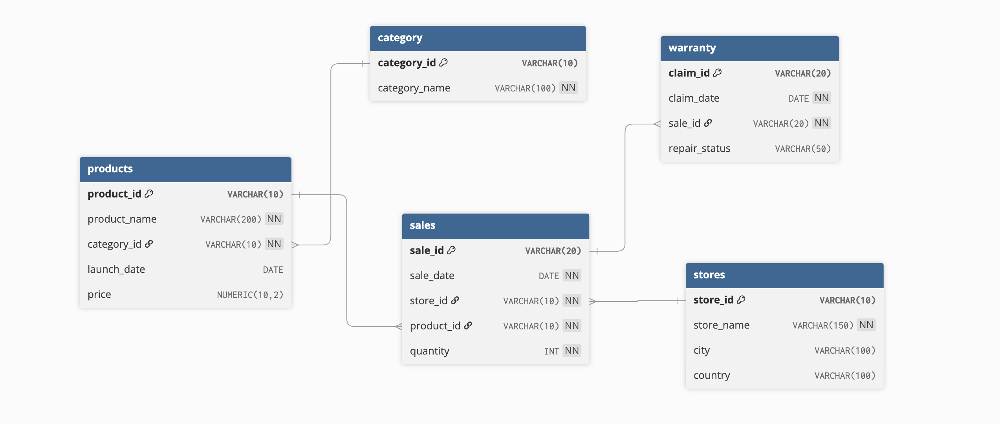

## Apple Retail Sales — SQL & Tableau Project

## Overview
This project demonstrates end-to-end SQL database design, data analysis, and visualization for a fictional Apple retail network.
It includes:
* A normalized SQL schema
* ERD diagram
* Business analysis queries
* A complete Tableau dashboard

The project includes **five main tables**:

1. **Category** – stores product categories (e.g., iPhone, iPad, Accessories)  
2. **Products** – stores product details including category, launch date, and price  
3. **Stores** – stores retail store details including city and country  
4. **Sales** – tracks sales transactions including quantity and linked store/product  
5. **Warranty** – tracks warranty claims linked to sales  

## What I Did
- **Downloaded the dataset** from Kaggle ([link to dataset](https://www.kaggle.com/datasets/amangarg08/apple-retail-sales-dataset)). 
- **Uploaded the dataset** to PostgreSQL using pgAdmin.  
- **Created tables** for categories, products, stores, sales, and warranty.  
- **Established relationships** between tables using **primary keys** and **foreign keys** to ensure data integrity.
- *(Primary keys uniquely identify records in a table, while foreign keys establish relationships between tables.)* 
- **Visualized the database schema** using [dbdiagram.io](https://dbdiagram.io/) to generate an **ERD diagram**.

## Entity-Relationship Diagram (ERD)

- **Run Business Queries**:
* Total revenue by category
* Top-selling products
* Monthly revenue trend
* Store-wise revenue
* Product pricing analysis
* Warranty claim patterns
* Window-function ranking
* Category revenue contribution

## Built a tableau dashboard to visualize the data
  

## Key Insights

- Tablets, Smartphones, and Accessories generate the highest revenue.
- Monthly revenue remains stable with occasional seasonal dips.
- Few stores account for most warranty claims.
- Certain premium products contribute high revenue despite low sales volume.

## How to Use
1. **Open pgAdmin** and connect to your PostgreSQL server.  
2. **Run the SQL script** `01_schema_setup.sql` to create tables and relationships.  
3. **Optionally**, refer to `ERD_diagram.png` to visualize the database structure.
4. **Run the SQL script** `apple_retail_business_queries.sql` to understand the key business insights
5. Import all CSVs → Build charts or use included dashboard layout.

## Skills Demonstrated
- Database design and normalization  
- Table creation in PostgreSQL using SQL
- SQL (DDL, DML, Joins, CTEs, Window Functions)  
- Establishing **primary key** and **foreign key relationships**  
- ERD generation using dbdiagram.io
- Tableau Dashboard Design
- Data Cleaning & ETL
- Analytical Problem-Solving
- GitHub Project Structuring & Documentation

